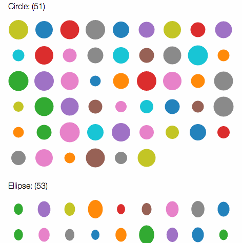

# d3.layout.grid

> Lightweight grid layout designed for categorical data



Demo: http://felixlaumon.github.io/d3.layout.grid/examples/basic.html

`d3.layout.grid` is designed to display categorical data, allowing users to sort and group by different categorical variables.

To maintain flexibility and the possibility to animate between layout type (e.g. between grid and force layout), `d3.layout.grid` does not include animation logic, but set `x` and `y` coordinates to the data.

Like other classes in D3, `d3.layout.grid` is chainable.

## Quick Start

````js
var grid = d3.layout.grid()
  .width(500)
  .height(1000)
  .data(data)
  .groupBy('color')

d3.selectAll('circle')
  .enter()
    .append('circle')
    .attr('r', 10)
    .attr('cx', function (d) { return d.x; })
    .attr('cy', function (d) { return d.y; })
    .attr('fill', function (d) { return d.color; })
````

See `examples/basic.html` and `examples/basic.js` for a complete example.

## API

### grid = d3.layout.grid()

Returns a new grid layout with the following default settings:

- `width` = 500
- `height` = 1000
- `colWidth` = 50
- `rowHeight` = 50
- `sectionPadding` = 100
- `marginLeft` = 50
- `marginTop` = 100

### grid.data([data])

Data associated with the grid. Relayouting (triggered by `groupBy(...)` or `sort(...)`) will set `x` and `y` properties to each `datum`, which can then be used for animation.

### grid.groupBy(string | fn)

Group data using [underscore's `_.groupBy`](http://underscorejs.org/#groupBy). 

Will trigger relayout.

### grid.sort(groupComparator, dataComparator)

`groupComparator` is used to produce the group order, which is invoked with the group names (a `string`) from `grid.groupBy()`

`dataComparator` is used to sort the data *within* a group, which is inovked with the data from `grid.data()`

Will trigger relayout.

### grid.groups()

Returns information about current grouping. Most notably it returns the y-coordinate of each group, which allows easy placement for the group headers.

### grid.width(), grid.height(), grid.colWidth(), grid.rowHeight(), grid.sectionPadding(), grid.marginLeft(), grid.marginTop()

If 1 argument is specified, set that corresponding config; otherwise return that config.

This should be normally done with the initialization of `d3.layout.grid()`. Note that this doesn't trigger a relayout. To change a config with animation, call `grid.relayout()`

### grid.relayout()

Force manual relayout of the grid

## License

ISC. Copyright (c) 2014 Felix Lau.
